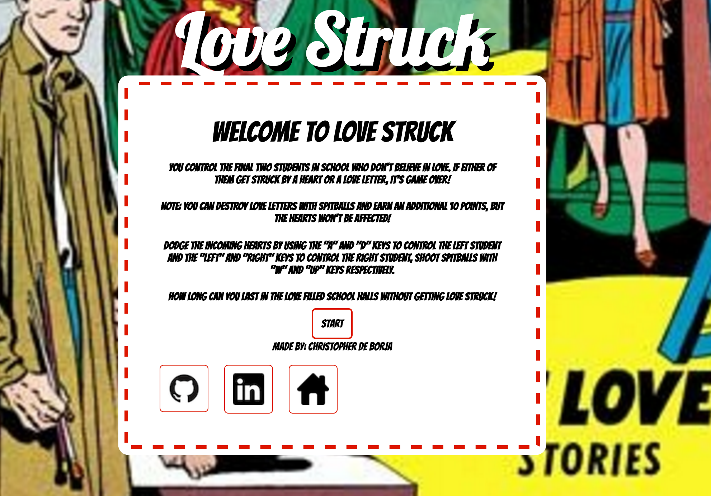
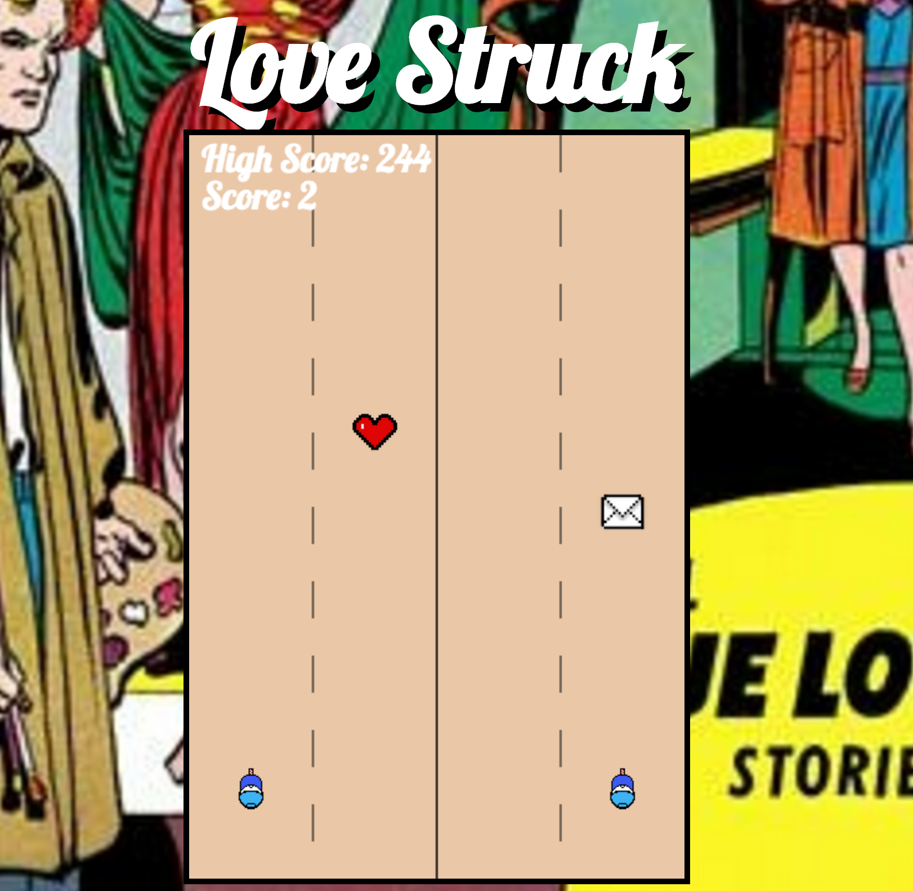

#Love Struck

Love is in the air!... but your two main characters aren't having any of it! You control the last two students who don't want to fall in love as they walk the halls of their school! Dodge as many hearts as possible and see how long how you can last until you become Love Struck!

Play Love Struck [here][LoveStruck]

###Landing Screen
[][LoveStruck]

###Gameplay Screen
[][LoveStruck]
[LoveStruck]: http://cdeborja.github.io/LoveStruck

## Languages and Technologies
* Javascript
* HTML
* jQuery
* CSS

##Libraries and Other Resources
* [Keymaster](https://github.com/madrobby/keymaster)

##Features
* Collision Detection enabled between all moving objects in DOM
* High score is stored in a local storage cookie so that it persists across play sessions
* As time progresses, uses settimeout to increase difficulty in gameplay
* Uses google fonts API
